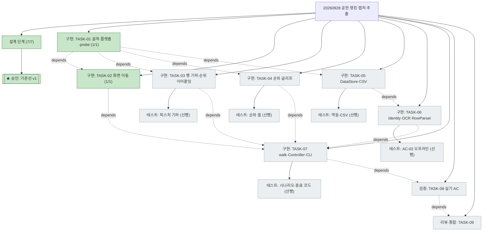

# PLAN-sgz-rankscan: 공헌 랭킹 캡처·추출 구현 계획

> 문서 유형: `plan`
> 작업 ID: `20260928-contrib-ranking-capture`
> 상태: `in-progress`
> 기준선: `v1` (승인일 2026-09-28)
> 작성일: 2026-09-28
> 최종 갱신: 2026-09-28
> 관련 문서: [REQ-sgz-rankscan: 요구사항](./requirements.md), [DESIGN-sgz-rankscan: 설계](./design.md), [WORK-20260928-contrib-ranking-capture: 작업 기록](./work/20260928-contrib-ranking-capture/work-log.md)

## 요약

- 목적: 승인된 기준선 v1을 TDD 작업 단위로 번역하고 진행 상태를 추적한다.
- 현재 결론 또는 상태: TASK-01·02 완료(2026-09-28 22:08), TASK-03 착수 대기(세션 인계 지점). 작업 9개 — 골격·플랫폼 이식(01) → 화면 이동(02)·행 기하(03)·순위 글리프(04)·저장(05) → 행 파서(06) → 순회·CLI(07) → 실기 검증(08) → 리뷰·통합·보고(09).
- 다음 행동: TASK-03 착수(작업 기록의 재개 지점 참조).

## 문서 연결

| 방향 | 관계 | 대상 문서 | 대상 항목 | 비고 |
|---|---|---|---|---|
| input | baseline | [REQ-sgz-rankscan: 요구사항](./requirements.md) | FR-01~10, NFR-01~05, AC-01~08 | 승인된 입력 기준선 v1 |
| input | baseline | [DESIGN-sgz-rankscan: 설계](./design.md) | DES-01~10 | 승인된 설계 v1 |
| input | decision | [ADR-001: 인식 전략](./work/20260928-contrib-ranking-capture/ADR-001-recognition-strategy.md) | ADR-001 | TASK-06 근거 |
| input | decision | [ADR-002: 순위 확정 전략](./work/20260928-contrib-ranking-capture/ADR-002-rank-assignment.md) | ADR-002 | TASK-03·04·07 근거 |
| output | implementation | [WORK-20260928-contrib-ranking-capture: 작업 기록](./work/20260928-contrib-ranking-capture/work-log.md) | document | 수행 내역·검증 결과·완료 보고 |

## 기준선

- 관련 요구사항: [요구사항 v1](./requirements.md) — FR-01~10, NFR-01~05, AC-01~08
- 관련 설계: [설계 v1](./design.md) — DES-01~10, [DES-02 상수](./design.md#des-02-상세), [DES-04 알고리즘](./design.md#des-04-상세)
- 관련 ADR·DCR: [ADR-001](./work/20260928-contrib-ranking-capture/ADR-001-recognition-strategy.md), [ADR-002](./work/20260928-contrib-ranking-capture/ADR-002-rank-assignment.md). DCR 없음.

## 작업 정의

- 목표: `rankscan` CLI로 공헌 랭킹 1~600위를 순회·캡처·추출·저장하고 AC-01~08을 증거와 함께 충족한다.
- 범위: [요구사항 §범위 포함](./requirements.md#포함) 전체.
- 범위 밖: [요구사항 §범위 제외](./requirements.md#제외). 커밋·push는 사용자 요청 시에만.
- 가정: 기준선 가정 A-01~A-08. 실기 검증은 사용자가 허용한 현재 클라이언트(창 0x206be)와 승격 러너를 사용한다.
- 위험: RISK-01~09(기준선). 계획 고유 — 실기 캘리브레이션(TASK-08)이 상수 초기값과 크게 어긋나면 TASK-02·03 픽스처 기대값 갱신 필요(경미한 변경으로 처리).

## 계획 트리

<!-- generated — wf-tree 렌더링 생성물. 수정은 아래 작업 목록에서 하고 재생성한다. 활성 경로 중심 뷰. -->

```text
[작업] 20260928-contrib-ranking-capture 공헌 랭킹 캡처·추출 ..... in-progress (2/9)
├─ [✓] 설계 단계 (조사·P-01·P-02·요구사항·설계·ADR-001·002) (7/7) ... 2026-09-28 22:05
├─ [✓★] 승인: 기준선 v1 ............................................ 2026-09-28 22:05
├─ [✓] 구현: TASK-01 골격·플랫폼 계층 이식·probe (1/1) ............ 2026-09-28 21:59
├─ [✓] 구현: TASK-02 화면 판정·이동 (nav) (1/1)               depends: TASK-01  2026-09-28 22:08
├─ [ ] 구현: TASK-03 행 검출·이동량 측정·순위 이어붙임         depends: TASK-01
│      └─ [ ] 테스트: 픽스처 기하 (선행)
├─ [ ] 구현: TASK-04 순위 숫자 글리프 판독                     depends: TASK-01
│      └─ [ ] 테스트: 픽스처 순위 셀 (선행)
├─ [ ] 구현: TASK-05 DataStore·CsvExport                      depends: TASK-01
│      └─ [ ] 테스트: 멱등·라벨·CSV 열 (선행)
├─ [ ] 구현: TASK-06 IdentityMatcher·OcrReader·RowParser      depends: TASK-05
│      └─ [ ] 테스트: AC-02 오프라인 (선행)
├─ [ ] 구현: TASK-07 ListScroller.walk·Controller·CLI         depends: TASK-02, 03, 04, 06
│      └─ [ ] 테스트: 가짜 판정기 시나리오·종료 코드 (선행)
├─ [ ] 검증: TASK-08 실기 캘리브레이션·AC-01/03/04/05/06/07/08  depends: TASK-07
└─ [ ] 리뷰·통합: TASK-09 자체 리뷰·README·완료 보고           depends: TASK-08
```



## 작업 목록

공통: 각 TASK는 [wf-implement TDD 사이클](file:///C:/Users/hippo/.claude/skills/wf-implement/SKILL.md)(Red → Green → Refactor)로 진행하고, 이식 모듈은 파일 머리에 출처·복사일·변경점 주석을 남긴다. 테스트 체계는 `unittest`(`python -m unittest discover -s tests`, sgz_statiz와 동일).

### TASK-01: 프로젝트 골격·플랫폼 계층 이식·probe

- 상태: completed
- 완료: 2026-09-28 21:59
- 상위: 없음
- 목표: 패키지 `rankscan`이 설치되고, 창 탐색·캡처·입력 계층과 `probe` 명령이 동작한다.
- 관련 요구사항과 설계: FR-09, NFR-04, NFR-05 / DES-01, DES-10(probe)
- 변경 대상: `pyproject.toml`, `.gitignore`, `.gitattributes`, `src/rankscan/__init__.py`, `src/rankscan/win/{win32,capture,input,session}.py`(sgz_statiz 무수정 복사), `src/rankscan/cli.py`(probe만; `--click`·`--wheel`·`--settle`), `src/rankscan/controller.py`(`choose_window` 이식), `tools/agent_shell.ps1`·`tools/agent_shell_admin.bat`(복사), `.venv` 생성 + `pip install -e .`, `tests/test_smoke.py`, `tests/test_controller.py`(choose_window 이식). 실제 추가: `src/rankscan/nav/ui_ranking.py`(`SCROLL_POINT`만 — probe `--wheel` 지점, [작업 기록](./work/20260928-contrib-ranking-capture/work-log.md#수행-기록) 참조)
- 의존성: 없음
- 위험: `windows-capture`·`winocr` 설치 실패(네트워크) → sgz_statiz venv의 버전을 고정해 재시도.
- 검증 방법: 선행 테스트 `tests/test_smoke.py`(패키지·win 모듈 임포트, `find_client_windows()`가 list 반환), `tests/test_controller.py`(단일 후보 자동 선택·번호 선택·q 중단·EOF). 후행: `rankscan probe`로 실기 창 목록·스냅샷 출력(승격 불필요).
- 완료 조건: `unittest discover` 통과, probe 스냅샷 파일 생성.

### TASK-02: 화면 판정·이동 (nav)

- 상태: completed
- 완료: 2026-09-28 22:08
- 상위: 없음
- 목표: 메인(메뉴 열림 허용)에서 공헌 랭킹 탭까지 마커 판정 기반으로 이동하고, 이미 도달 상태면 클릭 없이 통과한다.
- 관련 요구사항과 설계: FR-01, NFR-02, AC-01 / DES-02, DES-03
- 변경 대상: `src/rankscan/nav/navigator.py`(sgz_statiz 이식), `src/rankscan/nav/ui_ranking.py`(DES-02 상수), `src/rankscan/nav/ranking.py`(`RankingNavigator.goto_contrib_tab`), `assets/templates/ui/{main_more,menu_alliance}.png`(복사), `assets/templates/ui/{ranking_title,contrib_tab_on}.png`(`img/p01_contrib_top.png`에서 수확), `assets/templates/README.md`, `tests/test_ranking_nav.py`. 실제 차이: 메뉴 마커는 `menu_alliance.png` 재사용 대신 `menu_ranking.png` 신규 수확(P-01 메뉴 배치 변경으로 0.47), `ui_template()`는 `navigator.py`에 배치 — [작업 기록](./work/20260928-contrib-ranking-capture/work-log.md#설계와-달라진-점) 참조
- 의존성: TASK-01
- 위험: 탭 마커 상자가 비활성 탭과 겹쳐 오탐 → 교차 NCC 테스트로 상자 조정.
- 검증 방법: 선행 테스트 — (a) 마커 4종 교차 NCC: 자기 화면 픽스처(`img/p01_main`, `p01_menu`, `p01_contrib_top`, `ranking_1`) ≥ 0.8, 타 화면 < 0.8; (b) `goto_contrib_tab` 가짜 판정기·입력 시퀀스: 메인 시작(클릭 3회), 메뉴 열림 시작(2회), 이미 공헌 탭(0회), 무반응 1회 재시도, 잘못된 화면 `WrongScreen`. 후행: 실기 이동 1회(TASK-08에서 AC-01 판정).
- 완료 조건: 테스트 통과.

### TASK-03: 행 검출·이동량 측정·순위 이어붙임

- 상태: pending
- 상위: 없음
- 목표: 프레임에서 완전 가시 행 상단 y를 검출하고, 두 프레임 사이 이동량을 측정하며, anchor 기준으로 순위를 배정하는 순수 함수를 제공한다([ADR-002](./work/20260928-contrib-ranking-capture/ADR-002-rank-assignment.md) 1~3, 6).
- 관련 요구사항과 설계: FR-02, FR-03 / DES-02, DES-04 상세 2·3·6
- 변경 대상: `src/rankscan/nav/list_scroller.py`(`detect_row_tops`, `visible_rows`, `measure_shift`, `assign_ranks`, `anchor_band`), `tests/test_list_geometry.py`
- 의존성: TASK-01(상수 모듈 위치는 TASK-02와 공유 — `ui_ranking.py`가 없으면 이 작업에서 목록 기하 상수만 먼저 둔다)
- 위험: 행 테두리 밝기 피크 규칙이 끝 화면·상단 클리핑에서 흔들림 → 픽스처 3종으로 고정.
- 검증 방법: 선행 테스트 — `p01_contrib_top` 완전 가시 6행(상단 203, 275, 346, 417, 488, 559), `p01_w1` 5행(598 행은 하단 잘림 제외), `p01_end_r595_600` 6행(202…558); `measure_shift(contrib_top→w1) == 33`, `(w1→w2) == 33`; `assign_ranks(anchor=(6, 559→526), tops)` → 2~6; `measure_shift(b10→b11)`는 임계 미달로 `None`(겹침 상실).
- 완료 조건: 테스트 통과.

### TASK-04: 순위 숫자 글리프 판독

- 상태: pending
- 상위: 없음
- 목표: 순위 셀에서 흰색 0~9·금색 1~3을 판독한다([ADR-002](./work/20260928-contrib-ranking-capture/ADR-002-rank-assignment.md) 3).
- 관련 요구사항과 설계: FR-03 / DES-08
- 변경 대상: `src/rankscan/vision/digits.py`(sgz_statiz 이식, 템플릿 디렉터리 `digits_rank`), `assets/templates/digits_rank/*.png`(수확: `p01_b10_r121`(1~5), `p01_end_r595_600`(0, 5~9), `p01_w11`(4~9), `p01_contrib_top`(금색 1~3)), `tools/harvest_digits.py`(픽스처 순위 셀에서 글리프 클러스터를 잘라 저장 — 1회성 도구), `tests/test_rank_digits.py`
- 의존성: TASK-01
- 위험: 금색 글리프의 채도 필터(`_TEXT_MAX_SAT`) 불일치 → 금색 전용 마스크 파라미터 추가(내부 세부).
- 검증 방법: 선행 테스트 — 픽스처 순위 셀 판독: contrib_top `1..6`, w11 `4..9`, b10 `121..125`, end `595..600` 정확 일치.
- 완료 조건: 테스트 통과, 글리프 대장 `assets/templates/README.md` 갱신.

### TASK-05: DataStore·CsvExport

- 상태: pending
- 상위: 없음
- 목표: 설계 스키마의 SQLite 원장과 CSV 내보내기.
- 관련 요구사항과 설계: FR-06, FR-07, FR-10, NFR-03, AC-06 / DES-09
- 변경 대상: `src/rankscan/store/datastore.py`(sgz_statiz 골격 이식, 스키마 교체: `runs`·`identities`·`identity_templates`·`rank_rows`), `src/rankscan/store/csv_export.py`, `tests/test_datastore.py`, `tests/test_csv_export.py`
- 의존성: TASK-01
- 위험: 없음(순수 로컬).
- 검증 방법: 선행 테스트 — run 생성·마감(status/note), `upsert_row` 같은 `(run, rank)` 재저장 시 1건, 다른 run은 별도 보존, identities pending→confirm 조회 반영, CSV 열 순서와 `#id(제안)` 표기, UTF-8 BOM.
- 완료 조건: 테스트 통과.

### TASK-06: IdentityMatcher·OcrReader·RowParser

- 상태: pending
- 상위: 없음
- 목표: 행 크롭에서 세력명·지역·동맹 ID와 순위 판독값을 담은 `RankRow`를 만든다([ADR-001](./work/20260928-contrib-ranking-capture/ADR-001-recognition-strategy.md)).
- 관련 요구사항과 설계: FR-05, FR-07, AC-02, AC-05 / DES-05, DES-06, DES-07
- 변경 대상: `src/rankscan/vision/identity.py`(이식), `src/rankscan/vision/ocr.py`(이식·축소: `suggest_label`만, 4배 이진화 우선), `src/rankscan/vision/row_parser.py`, `tests/test_row_parser.py`
- 의존성: TASK-05(DataStore), TASK-04(순위 판독)
- 위험: 텍스트 스트립 임계 0.80이 행 y 배경 차이로 흔들림 → 픽스처 교차 측정으로 보정(경미).
- 검증 방법: 선행 테스트 — AC-02: `img/ranking_1.png` 6행 파싱 → 지역 ID 6행 동일, 동맹 ID {1,2,3,5} 동일·4·6 상이, 세력명 ID 6개 상이, `parse_status == ok`, 재파싱 시 신규 등록 0건(멱등). OCR 제안은 winocr 존재 시에만(`skipUnless`).
- 완료 조건: 테스트 통과.

### TASK-07: ListScroller.walk·Controller·CLI

- 상태: pending
- 상위: 없음
- 목표: 순회 루프(시작 조건·처리·종료·겹침 상실 복구·순위 충돌 처리)와 `scan|export|label` 명령, 실행 요약, 종료 코드.
- 관련 요구사항과 설계: FR-02, FR-03, FR-04, FR-08, FR-09, NFR-01, AC-03, AC-04, AC-08 / DES-04 상세 1·4·5·7, DES-10
- 변경 대상: `src/rankscan/nav/list_scroller.py`(`ListScroller.walk`, `WalkSummary`), `src/rankscan/controller.py`(`run_scan`, `label_pending`, `summarize_run`), `src/rankscan/cli.py`(scan·export·label 추가), `tests/test_list_scroller.py`, `tests/test_controller.py`(확장)
- 의존성: TASK-02, TASK-03, TASK-04, TASK-06
- 위험: 가짜 판정기 시나리오가 실기 타이밍을 대변하지 못함 → TASK-08에서 보정.
- 검증 방법: 선행 테스트 — 픽스처 프레임 시퀀스를 재생하는 가짜 판정기·입력으로 (a) `--max-rank 6` 첫 화면 종료, (b) 끝 화면 `same_image` 종료(`stop_reason=end`), (c) 겹침 상실 → 되감기 휠(+) 기록 → 재측정 성공, (d) 순위 충돌 → 재취득 → 재발 시 `aborted`·exit 2, (e) 시작 시 1위 아님 → 되감기, (f) 셀 실패 행은 `partial` 저장 후 계속. `run_scan` 종료 코드 0/2, 요약 문자열 내용.
- 완료 조건: 테스트 통과, `rankscan --help` 4개 명령 노출.

### TASK-08: 실기 캘리브레이션·인수 조건 검증

- 상태: pending
- 상위: 없음
- 목표: 실기에서 상수(`SCROLL_NOTCHES`, 임계, 마커)를 보정하고 AC-01·03·04·05·06·07·08을 판정한다.
- 관련 요구사항과 설계: AC-01, AC-03, AC-04, AC-05, AC-06, AC-07, AC-08, NFR-01·02·05 / DES-02 보정
- 변경 대상: `src/rankscan/nav/ui_ranking.py`(보정값), 작업 기록 검증 절, `output/`(증거, 커밋 제외)
- 의존성: TASK-07
- 위험: 실행 중 랭킹 갱신·클라이언트 상태 변화 → 재실행. AC-07(창 2개)은 두 번째 클라이언트 실행이 불가하면 미수행으로 기록.
- 검증 방법: 승격 러너로 (1) `probe` 마커 점수 확인, (2) `scan --max-rank 12` → AC-08·AC-01, (3) `scan`(600) → AC-03(순위 집합 1~600 결측·중복 0, 크롭 600장), 요약 → AC-04, (4) `label` 일부 확정 후 `export` → AC-05·AC-06, (5) 가능하면 AC-07.
- 완료 조건: 각 AC의 결과·증거가 작업 기록 검증 절에 기록됨(미수행은 사유 포함).

### TASK-09: 자체 리뷰·통합·문서·완료 보고

- 상태: pending
- 상위: 없음
- 목표: wf-implement §3.5 자체 리뷰, README·자산 대장 정리, 계획·작업 기록 동기화, 완료 보고.
- 관련 요구사항과 설계: 전체
- 변경 대상: `README.md`, `assets/templates/README.md`, `docs/plan.md`(상태·트리), `docs/work/…/work-log.md`(검증·완료 보고·트리 스냅숏)
- 의존성: TASK-08
- 위험: 없음.
- 검증 방법: 전체 `unittest discover` 최종 실행, 링크 검사 스크립트, wf-doc 자체 검토 목록.
- 완료 조건: [wf-implement 완료 조건](file:///C:/Users/hippo/.claude/skills/wf-implement/SKILL.md) 전부 충족 또는 부분 완료 사유 기록.

## 검증 계획

| 인수 조건 | 검증 항목(예정) | 방법 | 작업 |
|---|---|---|---|
| AC-01 | VER-01 | 실기 이동 | TASK-08 |
| AC-02 | VER-02 | 오프라인 단위 테스트(`ranking_1.png`) | TASK-06 |
| AC-03 | VER-03 | 실기 600위 순회 + DB 순위 집합 검사 | TASK-08 |
| AC-04 | VER-04 | 실기 요약(실패 행 격리) + 단위(f) | TASK-07·08 |
| AC-05 | VER-05 | `label` 후 조회·CSV 반영 | TASK-05·08 |
| AC-06 | VER-06 | CSV 열 단위 테스트 + 실기 export | TASK-05·08 |
| AC-07 | VER-07 | 단위(choose_window) + 실기(가능 시) | TASK-01·08 |
| AC-08 | VER-08 | 단위(a·b) + 실기 `--max-rank 12` | TASK-07·08 |

## 마이그레이션과 롤백

- 신규 저장소·신규 DB. 롤백은 `output/` 삭제. 게임 상태 변경 없음.

## 인계

- 다음 단계 또는 워크플로우: wf-implement 구현(TASK-01부터).
- 시작 조건: 충족(기준선 v1 승인).
- 입력 문서와 기준선: [요구사항 v1](./requirements.md), [설계 v1](./design.md), [ADR-001](./work/20260928-contrib-ranking-capture/ADR-001-recognition-strategy.md), [ADR-002](./work/20260928-contrib-ranking-capture/ADR-002-rank-assignment.md)
- 완료된 항목: 계획 수립, TASK-01(2026-09-28 21:59), TASK-02(2026-09-28 22:08).
- 미완료 항목: TASK-03~09.
- 차단 요인: 없음.
- 다음 행동: [작업 기록 재개 지점](./work/20260928-contrib-ranking-capture/work-log.md#재개-지점) 참조.
